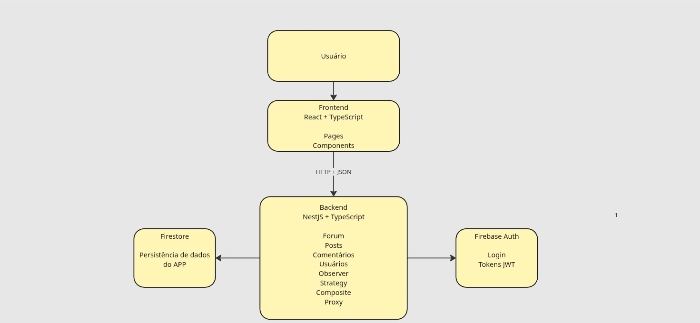
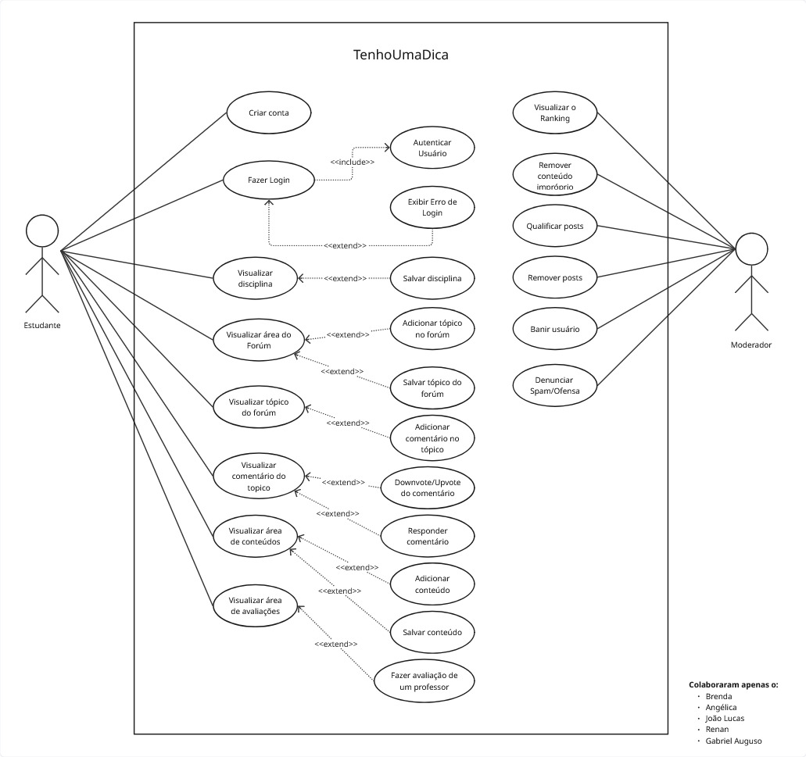

# Documento de Arquitetura de Software (DAS)

## 1. Introdução

### 1.1 Objetivo

O Documento de Arquitetura de Software (DAS) tem como propósito central registrar, de forma estruturada e rastreável, as decisões arquiteturais do sistema **TenhoUmaDica**, fornecendo uma visão abrangente de sua organização interna, componentes, subsistemas e interações. O documento cumpre o papel de referência técnica primária dentro da documentação do projeto, servindo como elo entre os requisitos funcionais e não funcionais levantados nas entregas anteriores e as escolhas de design que orientam a construção e a evolução do sistema.

O DAS é destinado a múltiplos públicos, cada qual com uma forma específica de utilização:

- **Desenvolvedores:** utilizam o documento para compreender a estrutura do sistema, os limites de responsabilidade de cada componente e as interfaces entre os módulos, orientando a implementação de novas funcionalidades e a manutenção do código existente.
- **Arquitetos de software:** recorrem ao documento para avaliar a consistência das decisões arquiteturais, identificar riscos técnicos e propor melhorias ou adaptações à medida que o sistema evolui.
- **Gestores e demais _stakeholders_:** utilizam o documento para obter uma visão de alto nível do sistema, compreender as implicações das decisões arquiteturais sobre prazos, custos e qualidade, e acompanhar o alinhamento entre os objetivos do projeto e a solução técnica adotada.
- **Avaliadores acadêmicos:** utilizam o documento para verificar a aplicação dos conceitos de arquitetura e desenho de software abordados ao longo da disciplina Arquitetura e Desenho de Software, ministrada na Universidade de Brasília, Campus Gama (FCTE/UnB).

A arquitetura é descrita tomando como referência o modelo **Visão 4+1**, proposto por Philippe Kruchten (1995). No escopo desta entrega, o documento cobre as visões consideradas mais relevantes para o estado atual do projeto: (i) **Visão de Casos de Uso**, que descreve os cenários de uso mais significativos do sistema, e (ii) **Visão Lógica**, que representa a decomposição do sistema em pacotes, classes e subsistemas. As demais visões previstas no modelo 4+1 (Implementação, Processos e Implantação) não foram confeccionados pelos integrantes.

### 1.2 Escopo

Este Documento de Arquitetura de Software aplica-se ao sistema **TenhoUmaDica**, plataforma acadêmica colaborativa desenvolvida para a comunidade estudantil da Faculdade UnB Gama (FCTE/UnB). O documento abrange o sistema em sua integralidade, compreendendo os seguintes subsistemas, módulos e componentes:

- **Subsistema Frontend:** Responsável pela camada de apresentação da aplicação web. Desenvolvido com React 19 e TypeScript, empacotado com Vite, utilizando Firebase para autenticação no lado cliente. São abrangidos os módulos de autenticação e controle de sessão, navegação por disciplinas e fóruns, publicação e visualização de dicas, sistema de votação (upvote/downvote), comentários com suporte a anexos, coleção de favoritos, perfis de usuário, avaliações de professores e disciplinas, painel de notificações e interface de moderação de conteúdo.

- **Subsistema Backend:** Responsável pela lógica de negócio, persistência de dados e exposição de serviços REST. Desenvolvido com NestJS 11 e TypeScript sobre Firebase (Firestore + Firebase Auth). São abrangidos os módulos de autenticação via Firebase ID Tokens, gerenciamento de usuários e permissões, publicações e repositório de materiais, sistema de avaliações, mecanismo de gamificação e reputação, moderação e denúncias, notificações e integração com sistemas acadêmicos externos.

- **Integração entre Subsistemas:** Abrange os contratos de comunicação entre Frontend e Backend, incluindo as interfaces de programação de aplicação (APIs RESTful), os mecanismos de autenticação e autorização, e a gestão de estado no lado cliente.

As decisões arquiteturais documentadas influenciam diretamente os seguintes aspectos do sistema:

- **Segurança:** definição dos mecanismos de autenticação, autorização e proteção de rotas privadas.
- **Escalabilidade e desempenho:** escolhas relativas à paginação de conteúdo, estratégias de busca e organização dos dados persistidos.
- **Manutenibilidade:** decomposição modular do sistema em subsistemas com responsabilidades bem definidas e interfaces explícitas.
- **Rastreabilidade:** alinhamento entre os requisitos funcionais e não funcionais levantados nas entregas anteriores e os componentes arquiteturais descritos neste documento.

### 1.3 Definições, Acrônimos e Abreviações

Esta seção apresenta os termos técnicos e acrônimos relevantes para a interpretação do documento. Os termos específicos do domínio do sistema (Dica, Tópico, Feed, Membro, Moderador, Material, Categoria, Matéria, Reputação, Tags, Upvote/Downvote, entre outros) são definidos no Glossário Oficial do Projeto, disponível na Entrega 01.

| Termo   | Significado                                                                                                                                    |
| :------ | :--------------------------------------------------------------------------------------------------------------------------------------------- |
| UnB     | Universidade de Brasília                                                                                                                       |
| FCTE    | Faculdade de Ciências e Tecnologias em Engenharia, unidade da UnB localizada no Gama                                                           |
| FGA0208 | Código da disciplina Arquitetura e Desenho de Software                                                                                         |
| DAS     | Documento de Arquitetura de Software                                                                                                           |
| RUP     | Rational Unified Process                                                                                                                       |
| SAD     | Software Architecture Document                                                                                                                 |
| GoF     | Gang of Four, autores do catálogo clássico de padrões de projeto                                                                               |
| MVP     | Minimum Viable Product (Produto Mínimo Viável)                                                                                                 |
| DTO     | Data Transfer Object                                                                                                                           |
| SPA     | Single Page Application                                                                                                                        |
| API     | Application Programming Interface                                                                                                              |
| REST    | Representational State Transfer                                                                                                                |
| JWT     | JSON Web Token                                                                                                                                 |
| LGPD    | Lei Geral de Proteção de Dados                                                                                                                 |
| RBAC    | Role Based Access Control                                                                                                                      |
| SIGAA   | Sistema Integrado de Gestão de Atividades Acadêmicas, sistema oficial da UnB utilizado como referência para dados de disciplinas e professores |
| BPMN    | Business Process Model and Notation                                                                                                            |
| UML     | Unified Modeling Language                                                                                                                      |

### 1.4 Referências

As referências bibliográficas e fontes consultadas para a elaboração deste documento estão listadas integralmente na **Seção 9 (Referencias)** deste documento.

### 1.5 Visão Geral

O restante do documento está organizado da seguinte forma:

- A **Seção 2** apresenta a representação arquitetural adotada e descreve as visões utilizadas.
- A **Seção 3** descreve os objetivos e restrições arquiteturais que orientam as decisões de projeto.
- A **Seção 4** apresenta a visão de casos de uso, com os cenários mais relevantes em termos arquiteturais.
- A **Seção 5** detalha a visão lógica, incluindo a decomposição em pacotes, classes significativas e padrões de projeto aplicados.
- A **Seção 6** aborda o dimensionamento e o desempenho do sistema.
- A **Seção 7** apresenta os atributos de qualidade endereçados pela arquitetura.
- A **Seção 8** consolida as participações dos integrantes do grupo na elaboração do documento.
- A **Seção 9** lista as referências bibliográficas e fontes consultadas.

---

## 2. Representação Arquitetural

A arquitetura do TenhoUmaDica segue o estilo Cliente-Servidor, com separação clara entre os subsistemas de frontend e backend, comunicando-se por meio de requisições HTTP via API RESTful. Para descrever essa arquitetura de forma sistemática, este documento adota o modelo de visões proposto por Kruchten (1995), o modelo 4+1. No escopo desta entrega, foram selecionadas a Visão de Casos de Uso e a Visão Lógica. As visões de Processos, Implantação e Implementação estão fora do escopo desta entrega.

### Subsistema Frontend

Desenvolvido com React 19 e TypeScript, empacotado com Vite, e entregue ao usuário como uma Single Page Application (SPA). O código fonte está organizado nos seguintes diretórios principais:

| Diretório | Responsabilidade |
|---|---|
| `src/components/` | Componentes reutilizáveis de interface (ex: `FirebaseAuthModal`) |
| `src/pages/` | Páginas da aplicação, organizadas por funcionalidade (`AvaliacoesPage`, `PostPage`) |
| `src/utils/` | Utilitários auxiliares, como `firebaseDebugToken` |
| `firebase.ts` | Configuração e inicialização do Firebase no lado cliente |

| Tecnologia | Papel Arquitetural |
|---|---|
| React 19 | Biblioteca principal para construção da interface baseada em componentes |
| TypeScript | Tipagem estática, aumentando robustez e manutenibilidade |
| Vite | Ferramenta de empacotamento e build da aplicação |
| Firebase Authentication (cliente) | Gerenciamento de sessão e autenticação no lado do cliente |

### Subsistema Backend

Desenvolvido com NestJS 11 e TypeScript, expõe os serviços da aplicação por meio de endpoints REST. O backend é organizado em módulos independentes, cada um seguindo a estrutura `controller/service/module` do NestJS:

| Módulo | Responsabilidade |
|---|---|
| `blocos/` | Implementação do padrão Composite para composição de conteúdo em blocos de texto, código e equação |
| `comentarios/` | Gerenciamento de comentários e threads hierárquicas, com interface `ComponenteComentario` |
| `forum/` | Fachada central do sistema (`ForumFacade`), unificando posts, comentários e tópicos |
| `posts/` | Criação tipada de posts via Factory Method, com cinco fábricas concretas |
| `observer/` | Implementação do padrão Observer para notificações entre `PostConteudo`, `Comentario` e `Usuario` |
| `ordenacao-strategy/` | Ordenação dinâmica do feed via padrão Strategy, com quatro estratégias concretas |
| `proxy/` | Cache de médias de avaliação de professores via padrão Proxy |
| `usuarios/` | Gerenciamento de usuários com padrão Builder, via `AlunoBuilder` e `AdministradorBuilder` |

| Tecnologia | Papel Arquitetural |
|---|---|
| NestJS 11 | Framework principal do backend, com organização modular e injeção de dependências |
| TypeScript | Tipagem estática aplicada à lógica de negócio e aos contratos de dados |
| Firebase Admin SDK | Validação de tokens e gerenciamento de usuários pelo backend |
| RxJS | Suporte à programação reativa em conjunto com o NestJS |
| class-validator / Zod | Validação e sanitização dos payloads de entrada nos endpoints REST |

### Persistência e Autenticação

| Tecnologia | Papel Arquitetural |
|---|---|
| Firebase Authentication | Gerenciamento centralizado de identidade, login e controle de acesso |
| Firestore | Banco de dados NoSQL utilizado para persistência do estado da aplicação |

### Integração entre Subsistemas

A comunicação entre frontend e backend ocorre via API REST sobre HTTP, com payloads em JSON. O `auth.guard.ts` intercepta todas as requisições às rotas protegidas e valida o Firebase ID Token enviado no cabeçalho `Authorization`. O `ValidationPipe` global configurado no `main.ts` rejeita entradas malformadas antes que cheguem à lógica de negócio.

| Camada de Integração | Papel Arquitetural |
|---|---|
| API REST (NestJS) | Interface de contrato entre os subsistemas frontend e backend |
| `auth.guard.ts` | Intercepta requisições e valida Firebase ID Tokens antes do acesso a rotas protegidas |
| Firebase ID Token | Mecanismo de autenticação stateless entre cliente e servidor |

### Visões Arquiteturais Adotadas

O modelo 4+1 de Kruchten organiza a descrição arquitetural de um sistema de software em visões complementares, cada uma voltada a um conjunto específico de preocupações e públicos. No centro do modelo está a Visão de Casos de Uso, que orienta e conecta todas as demais visões, garantindo que as decisões arquiteturais permaneçam alinhadas aos requisitos funcionais do sistema. As visões restantes descrevem o sistema sob perspectivas distintas: a Visão Lógica trata da organização interna em elementos de design; a Visão de Processos aborda concorrência e sincronização; a Visão de Implementação descreve a organização do código-fonte; e a Visão de Implantação trata do mapeamento do software sobre a infraestrutura física. Para o escopo desta entrega, foram elaboradas as duas visões descritas a seguir.

A escolha das visões de Casos de Uso e Lógica reflete o escopo e o estágio atual do projeto. A Visão de Casos de Uso garante que a arquitetura permaneça orientada às necessidades reais dos usuários, servindo de elo entre os requisitos funcionais e as decisões de design. A Visão Lógica, por sua vez, descreve como o sistema é internamente estruturado para satisfazer esses requisitos, sendo a visão mais diretamente útil para orientar o desenvolvimento e comunicar as decisões arquiteturais à equipe. Juntas, essas duas perspectivas cobrem tanto o comportamento externo quanto a organização interna do TenhoUmaDica de forma suficiente para o contexto desta entrega acadêmica.

### Visão de Casos de Uso

A Visão de Casos de Uso descreve o sistema a partir da perspectiva dos seus atores e dos objetivos que eles buscam realizar ao interagir com a plataforma. Os elementos de modelo que compõem esta visão são:

| Elemento | Descrição |
|---|---|
| Atores | Representam os agentes externos que interagem com o sistema (Estudante e Moderador) |
| Casos de Uso | Representam as funcionalidades oferecidas pelo sistema a cada ator |
| Relacionamentos | Associações, inclusões, extensões e generalizações entre atores e casos de uso |
| Especificações | Descrições detalhadas dos fluxos principal, alternativo e de exceção de cada caso de uso |

### Visão Lógica

A Visão Lógica descreve a decomposição interna do sistema em elementos estruturais e comportamentais, respondendo a como o sistema é organizado para satisfazer os requisitos identificados na Visão de Casos de Uso. Os elementos de modelo que compõem esta visão são:

| Elemento | Diagrama | Descrição |
|---|---|---|
| Classes e interfaces | Diagrama de Classes | Entidades do domínio, seus atributos, métodos e relacionamentos |
| Pacotes e módulos | Diagrama de Pacotes | Agrupamentos lógicos do sistema e dependências entre eles |
| Componentes e interfaces | Diagrama de Componentes | Organização modular do sistema e contratos entre subsistemas |
| Interações temporais | Diagrama de Sequência | Troca de mensagens entre objetos ao longo do tempo em cenários selecionados |

## 3. Objetivos e Restrições Arquiteturais

Esta seção apresenta os requisitos com impacto significativo na arquitetura do TenhoUmaDica, separados em objetivos (metas a serem alcançadas pela arquitetura) e restrições (limites impostos ao projeto por fatores técnicos, organizacionais, acadêmicos, temporais e legais). Os requisitos detalhados foram levantados na Entrega 01, por meio de Brainstorm, Rich Picture, 5W2H, Diagrama de Ishikawa e Glossário.

### 3.1 Objetivos Arquiteturais

**Manutenibilidade.** O sistema deve permitir alterações localizadas sem efeitos colaterais em outros módulos. Esta meta justifica a divisão do back-end em módulos NestJS independentes (posts, comentários, usuários, fórum, observador, estratégia de ordenação e proxy) e a adoção de padrões GoF que reduzem o acoplamento entre componentes.

**Extensibilidade.** A arquitetura deve permitir a adição de novos tipos de post, novos algoritmos de ordenação do feed, novos perfis de usuário e novos eventos observáveis sem alterar o código cliente. Esta meta é endereçada pela aplicação dos padrões Factory Method (criação dos cinco tipos de post: `PostConteudo`, `PostMaterial`, `PostAvaliacao`, `PostTopico` e `PostAnuncio`), Builder (construção de usuários por meio de `AlunoBuilder` e `AdministradorBuilder`), Strategy (ordenação do feed com `OrdenaPorVotos`, `OrdenaPorData`, `OrdenaPorRelevancia` e `OrdenaPorMenosPopulares`) e Observer (notificações), respeitando o princípio Aberto/Fechado.

**Desacoplamento.** Os clientes devem depender de interfaces, não de implementações concretas. Esta meta orienta o uso das interfaces `ComponenteComentario`, `AlgoritmoOrdenacao`, `Professor` e `Notificavel`, bem como a centralização do acesso ao subsistema de fórum por meio de uma fachada (`ForumFacade`) que oculta `PostsService`, `ComentariosService` e `UsuariosService`.

**Testabilidade.** Os módulos devem ser testáveis em isolamento. Esta meta justifica a configuração do Jest no back-end, a separação clara entre controladores, serviços e modelos, e o uso intensivo de injeção de dependências oferecido pelo NestJS.

**Reuso.** Builders, fábricas e estratégias devem ser reutilizáveis em diferentes pontos do sistema, evitando duplicação de regras de criação e comportamento entre módulos.

**Segurança.** O acesso a rotas sensíveis deve exigir autenticação. Esta meta é endereçada pelo uso do Firebase Authentication, pela validação de tokens em um `AuthGuard` no NestJS e pela validação de payloads de entrada por meio de `class-validator` e `Zod`.

**Privacidade.** O sistema deve coletar apenas os dados acadêmicos estritamente necessários ao seu funcionamento, observando os princípios gerais da LGPD aplicáveis a um projeto acadêmico de uso interno na FCTE.

**Desempenho percebido.** Operações repetidas e potencialmente custosas, como o cálculo de média de avaliação de professores, devem ser otimizadas. Esta meta é endereçada pela aplicação do padrão Proxy com cache em `ProfessorProxy`.

**Usabilidade.** A interface deve ser familiar a usuários de redes sociais, conforme determinado na fase de Design Sprint da Entrega 01, inspirando-se no Reddit para reduzir a curva de aprendizado.

**Funcionalidades arquiteturalmente significativas.** São consideradas significativas para a arquitetura, e portanto orientam as decisões de projeto, as seguintes funcionalidades:

- Criação tipada de posts (conteúdo, material, avaliação, tópico e anúncio).
- Hierarquia recursiva de comentários e respostas em uma mesma thread.
- Avaliação de professores com cálculo de média sob demanda e cache.
- Ordenação dinâmica do feed por diferentes critérios (votos, data, relevância e popularidade inversa).
- Notificação automática de usuários inscritos em conteúdos ou comentários.
- Sistema de reputação baseado em upvotes e downvotes.
- Integração planejada com o SIGAA para importação de grades de disciplinas e cadastro de professores.

### 3.2 Restrições Arquiteturais

**Restrições técnicas.**

- Back-end implementado em NestJS 11 sobre TypeScript.
- Front-end implementado em React 19 com Vite e react-router-dom 7.
- Persistência e autenticação fornecidas pelo Firebase (Firestore e Firebase Auth), sem banco relacional próprio. Decisão tomada após o planejamento inicial registrado no 5W2H da Entrega 01 (que previa PostgreSQL com Prisma), em função do menor custo operacional e da simplicidade de provisionamento.
- Comunicação entre cliente e servidor por meio de API REST com payloads em JSON.
- Validação de dados de entrada por meio de `class-validator` e `Zod`, com `ValidationPipe` global configurado em modo `whitelist` e `forbidNonWhitelisted`.
- Aplicação web acessível por qualquer navegador moderno, sem dependência de instalação local.

**Restrições organizacionais.**

- Equipe composta por dez integrantes do grupo G3, todos estudantes de Engenharia de Software da FCTE.
- Distribuição do trabalho por subgrupos responsáveis por padrões de projeto distintos.
- Trabalho conduzido de forma majoritariamente assíncrona, com reuniões periódicas registradas em atas no repositório de documentação.
- Versionamento por Git no GitHub e publicação da documentação por meio de Docsify e GitHub Pages.

**Restrições acadêmicas.**

- Obrigatoriedade de aplicação de, no mínimo, um padrão GoF criacional, um estrutural e um comportamental, conforme orientação da disciplina.
- Cumprimento dos artefatos exigidos em cada entrega parcial (E1, E2 e E3), conforme cronograma da professora.

**Restrições temporais.**

- Cronograma de desenvolvimento e documentação restrita ao período de 16/03/2026 a 29/06/2026, conforme planejamento da disciplina.
- Utilização de sprints semanais, totalizando aproximadamente 8 sprints úteis, conforme estimado na Entrega 01.

**Restrições legais.**

- Aderência aos princípios gerais da LGPD aplicáveis ao tratamento de dados acadêmicos, considerando que o sistema lida com informações como matrícula, nome e e-mail institucional.

**Restrições econômicas.**

- Projeto de natureza acadêmica e sem orçamento financeiro associado. O custo de operação durante a validação deve permanecer em zero, o que reforça a escolha por serviços gratuitos, o Firebase e infraestrutura sem servidores dedicados.

**Premissas.**

- Os usuários do sistema são, prioritariamente, estudantes da UnB com vínculo ativo.
- O volume de dados durante a fase de validação é compatível com os limites do plano gratuito do Firebase.
- O sistema é didático e não possui acordo de nível de serviço (SLA) de produção.

---

# 4. Visão de Casos de Uso

Os casos de uso nessa parte descrevem como o usuário interage com o sistema para realizar determinadas tarefas ou atingir objetivos específicos. Eles representam os diferentes cenários de uso, mostrando as ações do consumidor e as respostas do sistema em cada situação. Essa técnica ajuda a compreender melhor o comportamento esperado da aplicação e garante que todos os requisitos funcionais sejam identificados e documentados de forma clara.

Nessa parte detalharemos o funcionamento do sistema a partir da perspectiva do usuário, facilitando o entendimento entre desenvolvedores, analistas e stakeholders. Com eles, é possível visualizar os principais fluxos de interação, identificar possíveis falhas ou melhorias e assegurar que o sistema atenda às necessidades reais dos consumidores e aos requisitos definidos no projeto.

## 4.1 Atores
A tabela a seguir apresenta os atores identificados no escopo do projeto TenhoUmaDica. Eles representam as entidades externas que interagem diretamente com as funcionalidades da plataforma, categorizados por seus respectivos níveis de permissão e atuação no sistema.

| Ator | Descrição |
|---|---|
| **Estudante** | Usuário principal da plataforma. Cria conta, faz login e autentica-se no sistema. Visualiza e interage com disciplinas, áreas do fórum, tópicos e comentários, podendo adicionar tópicos, comentar, dar downvote/upvote e responder comentários. Também visualiza e adiciona conteúdos, salva disciplinas, tópicos e conteúdos, visualiza áreas de avaliação e avalia professores. |
| **Moderador** | Responsável pela governança e qualidade do conteúdo da plataforma. Visualiza o ranking geral, qualifica posts, remove posts e conteúdo impróprio, bane usuários e atua sobre denúncias de spam ou ofensa. |

## 4.2 Casos de Uso Completos
Os casos de uso estão organizados em seis módulos funcionais identificados no fluxograma do sistema TenhoUmaDica.

### Módulo 1 — Autenticação e Acesso

Agrupa tudo o que diz respeito à entrada e validação do usuário no sistema.

| ID | Caso de Uso | Ator | Descrição |
| :--- | :--- | :--- | :--- |
| **UC01** | Criar conta | Estudante | Permite que um novo estudante se cadastre no sistema. |
| **UC02** | Fazer Login | Estudante | Permite ao estudante acessar o sistema utilizando suas credenciais. |
| **UC03** | Autenticar Usuário | Sistema | Valida as credenciais do usuário. *(Incluído obrigatoriamente por "Fazer Login" via `<<include>>`)*. |
| **UC04** | Exibir Erro de Login | Sistema | Apresenta uma mensagem de erro caso as credenciais sejam inválidas. *(Estende "Fazer Login" via `<<extend>>`)*. |

### Módulo 2 — Gestão de Disciplinas

Focado especificamente na visualização e organização das matérias pelo estudante.

| ID | Caso de Uso | Ator | Descrição |
| :--- | :--- | :--- | :--- |
| **UC05** | Visualizar disciplina | Estudante | Permite ao estudante acessar e visualizar as informações de uma disciplina específica. |
| **UC06** | Salvar disciplina | Estudante | Permite ao estudante favoritar ou salvar uma disciplina para acesso rápido. *(Estende "Visualizar disciplina")*. |

### Módulo 3 — Fórum e Interação Social

É o módulo mais denso, concentrando toda a parte de comunidade, discussões, engajamento e threads.

| ID | Caso de Uso | Ator | Descrição |
| :--- | :--- | :--- | :--- |
| **UC07** | Visualizar área do Fórum | Estudante | Permite ao estudante acessar a página principal ou listagem do fórum de discussões. |
| **UC08** | Adicionar tópico no fórum | Estudante | Permite a criação de uma nova thread/tópico de discussão. *(Estende "Visualizar área do Fórum")*. |
| **UC09** | Salvar tópico do fórum | Estudante | Permite ao estudante salvar um tópico de interesse. *(Estende "Visualizar área do Fórum")*. |
| **UC10** | Visualizar tópico do fórum | Estudante | Permite ler o conteúdo detalhado de um tópico específico. |
| **UC11** | Adicionar comentário no tópico | Estudante | Permite que o estudante insira um comentário na discussão geral do tópico. *(Estende "Visualizar tópico do fórum")*. |
| **UC12** | Visualizar comentário do tópico | Estudante | Permite focar na leitura dos comentários feitos em um tópico. |
| **UC13** | Downvote/Upvote do comentário | Estudante | Permite avaliar um comentário positivamente (Upvote) ou negativamente (Downvote). *(Estende "Visualizar comentário do tópico")*. |
| **UC14** | Responder comentário | Estudante | Permite criar uma resposta direta (reply) a um comentário específico. *(Estende "Visualizar comentário do tópico")*. |

### Módulo 4 — Repositório de Conteúdos

Área dedicada aos materiais de estudo, uploads e organização de acervo.

| ID | Caso de Uso | Ator | Descrição |
| :--- | :--- | :--- | :--- |
| **UC15** | Visualizar área de conteúdos | Estudante | Permite acessar a seção do sistema onde os materiais de estudo estão disponíveis. |
| **UC16** | Adicionar conteúdo | Estudante | Permite o envio (upload) ou criação de um novo material de estudo. *(Estende "Visualizar área de conteúdos")*. |
| **UC17** | Salvar conteúdo | Estudante | Permite salvar um material para visualização futura. *(Estende "Visualizar área de conteúdos")*. |

### Módulo 5 — Avaliação Docente

Módulo isolado para o sistema de feedback e notas dos professores.

| ID | Caso de Uso | Ator | Descrição |
| :--- | :--- | :--- | :--- |
| **UC18** | Visualizar área de avaliações | Estudante | Permite acessar a seção dedicada à avaliação do corpo docente. |
| **UC19** | Fazer avaliação de um professor | Estudante | Permite submeter uma nota ou análise sobre um professor. *(Estende "Visualizar área de avaliações")*. |

### Módulo 6 — Moderação e Administração

Painel restrito ao ator "Moderador", focado em manter a saúde da comunidade, ranqueamento e remoção de infrações.

| ID | Caso de Uso | Ator | Descrição |
| :--- | :--- | :--- | :--- |
| **UC20** | Visualizar o Ranking | Moderador | Permite ao moderador visualizar a classificação de usuários, tópicos ou conteúdos mais bem avaliados. |
| **UC21** | Remover conteúdo impróprio | Moderador | Permite a exclusão de materiais que violem as regras da plataforma. |
| **UC22** | Qualificar posts | Moderador | Permite ao moderador alterar a classificação, status ou destaque de uma postagem. |
| **UC23** | Remover posts | Moderador | Permite a exclusão de postagens no fórum que sejam indevidas. |
| **UC24** | Banir usuário | Moderador | Permite bloquear temporária ou permanentemente o acesso de um usuário infrator. |
| **UC25** | Denunciar Spam/Ofensa | Moderador | Permite ao moderador tratar, registrar ou encaminhar denúncias de mau comportamento. |

## 4.3 Casos de Uso Arquiteturalmente Significativos

Os casos de uso estão organizados em seis partes funcionais identificados no fluxograma do sistema.

| Código | Descrição |
|---|---|
| UC01 | Criar conta |
| UC02  | Fazer Login  |
| UC05 | Visualizar Disciplina |
| UC11  | Comentar |
| UC13  | Upvote / Downvote |
| UC17 | Favoritar (Salvar conteúdo) |

Essas são as especificações dos casos de uso arquiteturalmente significativos:

### UC01 — Criar Conta

| Campo | Descrição |
|---|---|
| **Nome** | Criar Conta |
| **Ator principal** | Estudante |
| **Pré-condição** | Usuário não possui conta no fórum |
| **Fluxo principal** | 1. Estudante acessa aba de cadastro   2. Preenche o formulário com seus dados (email, matricula, etc)   3. Sistema valida as informações   4. Sistema registra a nova conta no banco   5. Sistema redireciona para a tela de login |
| **Fluxo alternativo** | - |
| **Fluxo de exceção** | 3a. Matrícula já cadastrada no sistema, sistema não cadastra exibe erro  |
| **Pós-condição** | Conta de usuário criada com sucesso |

### UC02 — Fazer Login

| Campo | Descrição |
|---|---|
| **Nome** | Fazer Login |
| **Ator principal** | Estudante |
| **Pré-condição** | Estudante possui conta cadastrada no sistema |
| **Fluxo principal** | 1. Estudante acessa a aba de login   2. insere credencias   3. Clica no botão de entrar   4. Sistema executa a validação das credenciais (`«include»` Autenticar Usuário)   5. Sistema libera o acesso e redireciona para o feed |
| **Fluxo alternativo** | - |
| **Fluxo de exceção** | 4a. Credenciais inválidas ou não encontradas → Sistema aciona o comportamento de erro (`«extend»` Exibir Erro de Login) avisando o Estudante |
| **Pós-condição** | Estudante autenticado e com acesso às funcionalidades restritas |

### UC05 — Visualizar Disciplina

| Campo | Descrição |
|---|---|
| **Nome** | Visualizar Disciplina |
| **Ator principal** | Estudante |
| **Pré-condição** | Estudante autenticado |
| **Fluxo principal** | 1. Estudante busca ou seleciona uma disciplina na interface   2. Sistema carrega a página dedicada à disciplina   3. Sistema exibe as dicas, arquivos e avaliações vinculadas àquela matéria |
| **Fluxo alternativo** | 3a. Estudante decide acompanhar a disciplina de perto (`«extend»` Salvar Disciplina) → Sistema adiciona a matéria aos atalhos do perfil do Estudante |
| **Fluxo de exceção** | 2a. Falha ao carregar os dados ou disciplina inativa → Sistema exibe tela de erro e botão para voltar |
| **Pós-condição** | Conteúdo da disciplina exibido para navegação |

### UC11 — Comentar

| Campo | Descrição |
|---|---|
| **Nome** | Comentar |
| **Ator principal** | Estudante |
| **Pré-condição** | Estudante autenticado; dica publicada e visível |
| **Fluxo principal** | 1. Estudante abre uma dica   2. Estudante clica em "Comentar"   3. Sistema exibe campo de texto   4. Estudante redige o comentário   5. Estudante submete o comentário   6. Sistema valida o conteúdo   7. Sistema publica o comentário   8. Sistema notifica o autor da dica |
| **Fluxo alternativo** | 4a. Estudante anexa documento ou imagem ao comentário (`«extend»` Anexar arquivo) → Sistema valida o arquivo e associa ao comentário |
| **Fluxo de exceção** | 6a. Comentário vazio ou apenas espaços → Sistema bloqueia envio e exibe aviso   6b. Arquivo inválido ou muito grande → Sistema exibe erro e solicita novo arquivo |
| **Pós-condição** | Comentário publicado e vinculado à dica; autor da dica notificado |

### UC13 — Upvote / Downvote

| Campo | Descrição |
|---|---|
| **Nome** | Upvote / Downvote |
| **Ator principal** | Estudante |
| **Pré-condição** | Estudante autenticado; dica publicada e visível no feed |
| **Fluxo principal** | 1. Estudante visualiza uma dica   2. Estudante clica em upvote ou downvote   3. Sistema registra o voto   4. Sistema atualiza o score da dica no ranking   5. Contador de votos é atualizado na tela |
| **Fluxo alternativo** | 4a. Estudante já votou nessa dica → Sistema remove o voto anterior (toggle) e atualiza o score |
| **Fluxo de exceção** | 3a. Estudante tenta votar na própria dica → Sistema bloqueia e exibe mensagem de erro |
| **Pós-condição** | Voto registrado; score da dica atualizado |

### UC17 — Favoritar

| Campo | Descrição |
|---|---|
| **Nome** | Favoritar |
| **Ator principal** | Estudante |
| **Pré-condição** | Estudante autenticado; dica publicada e visível |
| **Fluxo principal** | 1. Estudante visualiza uma dica   2. Estudante clica em "Favoritar"   3. Sistema adiciona a dica à coleção pessoal do Estudante   4. Ícone de favorito é marcado na tela |
| **Fluxo alternativo** | 2a. Dica já está nos favoritos → Sistema remove dos favoritos (toggle) e desmarca o ícone |
| **Fluxo de exceção** | 3a. Erro de conexão ao salvar → Sistema exibe mensagem de falha e orienta o Estudante a tentar novamente |
| **Pós-condição** | Dica adicionada ou removida da coleção de favoritos do Estudante |

## 4.4  Diagrama de Casos de Uso
A figura a seguir apresenta o Diagrama de Casos de Uso da plataforma TenhoUmaDica, consolidando visualmente os atores envolvidos e as principais interações que eles podem realizar dentro da fronteira do sistema.

Autores: Angélica, Brenda, João Lucas, Renan, Gabriel Augusto

# 5. Visão Lógica

Conforme Serrano, a Visão Lógica **"trata da organização conceitual de um software em termos de camadas, subsistemas, pacotes, classes, interfaces e realizações de caso de uso"**. Esta seção aplica essa definição ao código-fonte da plataforma TenhoUmaDica, posicionando os componentes nos quatro círculos da Arquitetura Limpa de Robert C. Martin:

* **Entidades:** Modelos de domínio e contratos (interfaces) que guardam as regras de negócio mais gerais e estáveis. *"As regras de negócio devem permanecer puras, sem mistura com preocupações mais básicas como a interface do usuário ou o banco de dados (...) elas são as joias da família"* (Robert C. Martin).
* **Casos de Uso:** *Services*, *Factories* e *Builders* que organizam as entidades para realizar uma operação específica. Baseado no Princípio da Responsabilidade Única (SRP): *"Um módulo deve ser responsável por um, e apenas um, ator"* (Robert C. Martin).
* **Adaptadores de Interface:** *Controllers*, *DTOs*, *Guards*, *Facades* e componentes de View. *"Esta camada consiste em um conjunto de adaptadores que convertem dados no formato mais conveniente para os casos de uso para o formato mais conveniente para algum agente externo"* (Robert C. Martin).
* **Frameworks & Drivers:** Detalhes técnicos e ferramentas mantidos na borda do sistema. *"O componente Main é o detalhe final (a política de nível mais baixo). É o ponto de entrada inicial do sistema"* (Robert C. Martin).

---

## 5.1 Estrutura do Subsistema Backend (`app/back/src`)

A estrutura do servidor é organizada por pacotes de domínio funcional, utilizando o NestJS como framework para gerenciar os módulos e as dependências da aplicação. 

### 5.1.1 Núcleo da Aplicação (Composição e Bootstrap)

| Arquivo | Função no Sistema | Camada |
| --- | --- | --- |
| `main.ts` | Inicializa o Firebase Admin, cria a instância Nest, registra `ValidationPipe` global e abre a porta HTTP. | **Frameworks & Drivers** (Main) |
| `app.module.ts` | Agrega todos os módulos de domínio em um único grafo de dependências. | **Frameworks & Drivers** (Composição) |
| `app.controller.ts` | Expõe `GET /` e `GET /protected`, enviando a lógica para o serviço e a autenticação para o `auth.guard.ts`. | **Adaptador de Interface** |

### 5.1.2 Domínio `usuarios` (Padrão Builder)

| Arquivo | Função no Sistema | Camada |
| --- | --- | --- |
| `usuarios/models/usuario.ts` | Entidade-base com atributos e comportamentos comuns de um `Membro` (`autenticar`, `salvarTopico`). | **Entidade** |
| `usuarios/models/aluno.ts` / `admnistrador.ts` | Especializações contendo atributos e regras do domínio acadêmico da FCTE/UnB e de moderação. | **Entidade** |
| `usuarios/builders/usuarioBuilder.ts` | Interface do padrão *Builder*, definindo o contrato de construção passo a passo. | **Entidade** (Contrato) |
| `usuarios/builders/alunoBuilder.ts` / `admnistradorBuilder.ts` | Implementações concretas que constroem as entidades validando dados obrigatórios como matrícula. | **Caso de Uso** |
| `usuarios/usuarios.service.ts` | Controla os builders, chama o SDK do Firebase Admin e salva dados no Firestore com suporte a cancelamento (*rollback*). | **Caso de Uso** |
| `usuarios/usuarios.controller.ts` | Expõe as rotas de criação de perfis, enviando o fluxo para o serviço de domínio. | **Adaptador de Interface** |
| `usuarios/dtos/alunoDto.ts` / `admnistradorDto.ts` | Estruturas de validação de entrada baseadas nas regras de cadastro da plataforma. | **Adaptador de Interface** |
| `usuarios/usuarios.module.ts` | Declara providers e controllers do domínio para o módulo central. | **Frameworks & Drivers** | 

### 5.1.3 Domínio `posts` (Padrão Factory Method)

| Arquivo | Função no Sistema | Camada |
| --- | --- | --- |
| `posts/interfaces/post.interface.ts` | Contrato que define as ações estáveis de uma publicação, seja ela um tópico, material ou avaliação. | **Entidade** |
| `posts/models/post-conteudo.model.ts` | Classe-base concreta com estado do post e regras de negócio da plataforma. | **Entidade** |
| Subclasses (`post-topico.model.ts`, `post-avaliacao.model.ts`, etc.) | Variações estruturais do domínio (Tópicos com fóruns, Avaliações com notas, Materiais com anexos). | **Entidade** |
| `posts/factories/fabrica-conteudo.factory.ts` | Classe abstrata que define a assinatura de criação e o modelo de exibição. | **Caso de Uso** | Política de criação de objetos de domínio conforme o fluxo da aplicação (qual post instanciar). |
| Fábricas Concretas (`fabrica-topico.factory.ts`, etc.) | Implementações encarregadas de criar cada subtipo específico de postagem. | **Caso de Uso** |
| `posts/posts.service.ts` | Organiza as fábricas, gerencia o repositório em memória e junta as árvores de dados. | **Caso de Uso** | 
| `posts/posts.controller.ts` | Expõe endpoints protegidos por autenticação para criação e consumo de postagens e dicas. | **Adaptador de Interface** | 
| `posts/posts.module.ts` | Configura as ligações internas e injeções do pacote de postagens. | **Frameworks & Drivers** | 

### 5.1.4 Domínio `comentarios` e `blocos` (Padrão Composite)

| Componente / Pacote | Função no Sistema | Camada |
| --- | --- | --- |
| Interfaces estruturais (`ComponenteBloco.ts`, etc.) | Contratos base do padrão Composite para tratamento igual de coleções e itens únicos. | **Entidade** |
| Nós Folha (`comentario.model.ts`, `BlocoTexto.ts`, etc.) | Elementos individuais com regras isoladas de edição, denúncia ou formatação Markdown e LaTeX. | **Entidade** |
| Nós Compostos (`thread-comentario.model.ts`, `BlocoLista.ts`) | Agregadores que processam coleções estruturadas e respostas de forma repetitiva (linhas de comentários). | **Entidade** | 
| `comment-manager.ts` & `*.service.ts` | Serviços que controlam o ciclo de vida e mudam o tipo do item de Folha para Composto. | **Caso de Uso** | Organizam as entidades para servir operações da aplicação (exemplo: montar postagem com blocos). |
| `blocos/blocos.controller.ts` | Converte chamadas HTTP de mudança de blocos em chamadas aos serviços. | **Adaptador de Interface** |
| Módulos (`*.module.ts`) | Ligações e conexões do sistema de dependências do NestJS. | **Frameworks & Drivers** |

### 5.1.5 Domínio `observer` (Padrão Observer)

| Arquivo | Função no Sistema | Camada |
| --- | --- | --- |
| `observer/Observer.ts` / `Notificavel.ts` / `TipoEvento.ts` | Contratos e enums que definem o funcionamento de reatividade e avisos. | **Entidade** |
| `observer/Usuario.ts` | Implementação concreta do observador (guarda as notificações recebidas no perfil do Membro). | **Entidade** |
| `observer/PostConteudo.ts` / `Comentario.ts` | Sujeitos concretos (Subjects) que ativam notificações em suas rotinas internas. | **Entidade** |
| `observer/observer.service.ts` | Repositórios em memória; gerencia as ligações e o envio de alertas. | **Caso de Uso** |
| `observer/observer.controller.ts` | Expõe rotas REST para gerenciar observadores e testar notificações. | **Adaptador de Interface** | 

### 5.1.6 Domínio `ordenacao-strategy` (Padrão Strategy)

| Arquivo | Função no Sistema | Camada |
| --- | --- | --- |
| Contratos (`algoritmo-ordenacao.interface.ts`, etc.) | Abstração da regra de ordenação variável do feed e modelo do item ordenável, que, neste caso, é um tópico. | **Entidade** | 
| Estratégias Concretas (`OrdenaPorVotos.ts`, `OrdenaPorData.ts`, etc.) | Algoritmos de ordenação simples, isolados e livres de efeitos colaterais de banco de dados. | **Entidade** | 
| `ordenacao-strategy/Feed.ts` | Contexto do Strategy: guarda o algoritmo ativo e passa a tarefa de ordenação. | **Caso de Uso** | 
| `ordenacao-strategy.service.ts` | Lê o parâmetro de texto enviado pela requisição e ativa a estratégia certa. | **Caso de Uso** | Política de aplicação encarregada de "ordenar o feed conforme a escolha do cliente". |
| `ordenacao-strategy.controller.ts` / DTOs | Recebem os tópicos do fórum e os ordena de acordo com os parâmetros (Ordena por votos, data, etc...). | **Adaptador de Interface** |

### 5.1.7 Domínio `proxy` (Padrão Proxy (Avaliação de Professores e Disciplinas))

| Arquivo | Função no Sistema | Camada |
| --- | --- | --- |
| `proxy/Professor.ts` / `Avaliacao.ts` | Contrato comum e modelos puros que regem o sistema de avaliação baseado no SIGAA. | **Entidade** |
| `proxy/ProfessorReal.ts` | Classe encarregada de fazer o cálculo de médias direto nas coleções. | **Entidade** |
| `proxy/ProfessorProxy.ts` | Intercepta o objeto real, aplicando regras de cache invisível e controle de acessos. | **Caso de Uso** |
| `proxy/ProfessorService.ts` | Ponto de entrada do pacote; gerencia e organiza o ciclo de vida do par Real/Proxy. | **Caso de Uso** | 

### 5.1.8 Domínio `forum` (Padrão Facade)

| Arquivo | Função no Sistema | Camada |
| --- | --- | --- |
| `forum/forum.facade.ts` | Junta os serviços de vários pacotes em uma API simplificada para o fórum. | **Adaptador de Interface** |
| `forum/forum.controller.ts` / DTOs | Expõe o fórum via HTTP, incluindo lógicas de diagnóstico e registro de logs. | **Adaptador de Interface** |

---

## 5.2 Estrutura do Subsistema Frontend (`app/front/src`)

A aplicação cliente em React 19 separa as dependências de acordo com as camadas de Robert C. Martin, utilizando conceitos como *Humble Objects* e *Presenters* para isolar os componentes visuais das regras de infraestrutura.

| Arquivo / Componente | Função no Sistema | Camada |
| --- | --- | --- |
| `main.tsx` | Inicializa a árvore React e faz a montagem no ponto raiz do navegador (`#root`). | **Frameworks & Drivers** (Main) |
| `App.tsx` | Centraliza as rotas da interface do TenhoUmaDica usando o `react-router-dom`. | **Adaptador de Interface** (Humble Object) |
| Páginas (`PostPage.tsx`, `AvaliacoesPage.tsx`, etc.) | Fazem chamadas `fetch`, controlam subcomponentes e mostram dados na tela. | **Adaptador de Interface** (View/Presenter) |

## 5.3 Diagrama de Pacotes

O Diagrama de Pacotes a seguir apresenta a divisão lógica e física do código-fonte da plataforma TenhoUmaDica. Ele ilustra a separação clara entre o cliente (Subsistema Frontend em app/front/src) e o servidor (Subsistema Backend em app/back/src). A visualização demonstra como os pacotes de domínio funcional (como usuarios, posts e comentarios) ficam isolados e independentes no servidor, enquanto o núcleo da aplicação gerencia as conexões e dependências gerais. As setas indicam como os componentes se comunicam, evidenciando que os detalhes de infraestrutura tecnológica ficam restritos às bordas do sistema.

Autores: Gabriel Araújo, João Lucas

## 5.4 Diagrama de Classes

O Diagrama de Classes a seguir representa a estrutura interna e os comportamentos dos elementos que formam o backend da plataforma. O gráfico detalha os atributos, os métodos principais e os relacionamentos de herança e dependência das classes do sistema. A modelagem destaca a implementação prática de seis padrões de projeto clássicos (GoF) para resolver problemas específicos do domínio do Fórum TenhoUmaDica: o padrão Builder na criação de perfis de Membro; o Factory Method na geração de diferentes tipos de Dica; o Composite na organização das linhas de comentários; o Observer no envio de alertas; o Strategy na ordenação flexível do feed; e o Proxy no controle de acesso e cache de informações de professores vindas do SIGAA.

Autores: Gabriel Araújo, João Lucas

## 6. Tamanho e Desempenho

Esta seção descreve as principais características de dimensionamento do sistema TenhoUmaDica que impactam a arquitetura, bem como as restrições e metas de desempenho que orientam as decisões de projeto. As estimativas apresentadas derivam do artefato de Estimativa elaborado na Entrega 01, cujos valores foram obtidos por meio do método de Avaliação de Especialistas (Wideband Delphi), e do perfil de uso esperado da comunidade estudantil da FCTE/UnB.

### 6.1 Dimensionamento

As estimativas do projeto foram produzidas de forma independente pelos integrantes e, em seguida, consolidadas em discussão técnica de consenso, seguindo os passos do Wideband Delphi: coleta anônima individual, análise de divergências e convergência para um valor final. Os insumos utilizados foram os resultados do Brainstorm e o Rich Picture produzidos na Entrega 01.

Em termos de escopo funcional, o sistema contempla entre 25 e 35 funcionalidades mapeadas como histórias de usuário, distribuídas em aproximadamente 15 telas principais com variações de estado e perfil de acesso. Para o MVP, foi adotado um subconjunto priorizado dessas funcionalidades, conforme o backlog definido na Entrega 02.

O esforço de desenvolvimento foi estimado em 2 horas por dia útil por integrante, com sprints semanais, totalizando 8 sprints ao longo do período letivo (16/03/2026 a 29/06/2026). Com uma equipe de 10 integrantes, isso representa uma capacidade produtiva da ordem de 800 horas totais de desenvolvimento no projeto.

O custo operacional estimado para a fase de validação é de R$ 0, viabilizado pela escolha do Firebase no plano gratuito (Spark) como infraestrutura de persistência, autenticação e hospedagem de dados. Essa restrição econômica influencia diretamente a arquitetura: descarta servidores dedicados, banco de dados relacional próprio e qualquer serviço de terceiro com custo associado, reforçando a decisão registrada na Seção 3.2 de substituir o PostgreSQL com Prisma (previsto no 5W2H da Entrega 01) pelo Firebase.

A tabela a seguir consolida as estimativas finais aprovadas pelo grupo:

| Categoria | Métrica | Valor Final (Consenso) |
| :--- | :--- | :--- |
| **Tamanho** | Histórias de usuário | 25–35 funcionalidades / ~15 telas principais |
| **Esforço** | Dedicação por integrante | 2 horas por dia útil |
| **Custo operacional** | Infraestrutura e hospedagem | R$ 0 no MVP (Firebase Spark) |
| **Cronograma** | Sprints semanais | 8 sprints (~2 meses letivos) |
| **Custo de desenvolvimento** | Valor-hora estimado | R$ 800 por integrante (40h × R$ 20/h) |

*Fonte: Angélica, João Gabriel, João Reis e Brenda, 2026 (Artefato de Estimativas, Entrega 01.)*

O público-alvo é composto por estudantes com vínculo ativo na FCTE/UnB. As principais estimativas de volume para a fase de validação são:

| Métrica de Volume | Estimativa para o MVP |
| :--- | :--- |
| Usuários cadastrados | até 500 estudantes |
| Usuários simultâneos (pico) | até 50 sessões ativas |
| Disciplinas cadastradas | 138 (disciplinas ofertadas no semestre na FCTE) |
| Tópicos no fórum | até 1.000 ao longo do semestre |
| Avaliações de professores | até 300 por semestre |
| Materiais (uploads) | até 200 arquivos na fase inicial |

Esses volumes são compatíveis com os limites do plano Spark do Firebase, que prevê até 1 GB de armazenamento no Firestore e 10 GB de transferência de dados por mês.

### 6.2 Metas de Desempenho

Dado o caráter acadêmico e didático do sistema, não há acordo formal de nível de serviço (SLA). No entanto, a arquitetura foi concebida para atender às seguintes metas de desempenho percebido, alinhadas às expectativas de usabilidade de uma plataforma inspirada no Reddit e registradas nos requisitos não funcionais (RNF 15.3):

| Meta | Valor-alvo |
| :--- | :--- |
| Tempo de carregamento inicial da SPA (LCP) | inferior a 3 s em conexão banda larga |
| Tempo de resposta das rotas REST (leitura) | inferior a 500 ms em condições normais |
| Tempo de resposta para escrita (post, comentário, voto) | inferior a 1 s |
| Tempo de carregamento do feed paginado | inferior a 800 ms por página |
| Disponibilidade esperada | acima de 95% no período letivo |

### 6.3 Decisões Arquiteturais com Impacto no Desempenho

As seguintes decisões foram adotadas com o objetivo direto de atender às metas acima, e possuem rastreabilidade com os módulos descritos na Seção 5 (Visão Lógica):

* **Paginação do feed:** A listagem de tópicos, dicas e avaliações é carregada de forma incremental via cursores do Firestore, evitando que o cliente receba grandes volumes de dados em uma única requisição. Isso reduz o tempo de resposta percebido e o consumo de largura de banda. *Rastreabilidade: RNF 15.3 (Desempenho - Listas extensas devem usar paginação).*
* **Cache de médias de avaliação via Proxy:** O cálculo da média de avaliações de professores agrega múltiplos documentos no Firestore, tornando-se potencialmente custoso sob demanda repetida. O padrão Proxy (Cache) foi aplicado por meio do `ProfessorProxy` (domínio `proxy/`, Seção 5.1.7): o resultado de `calculaMediaAvaliacao()` é armazenado em memória e retornado diretamente enquanto `cacheValido = true`, sendo invalidado apenas quando uma nova avaliação é registrada. *Rastreabilidade: ProfessorProxy, US 10.1 (Avaliação de Disciplina).*
* **SPA com Vite:** A entrega da interface como uma Single Page Application construída com Vite (Seção 5.2) permite ao navegador beneficiar-se de *code splitting*, *tree-shaking* e compressão de assets estáticos, reduzindo o tamanho dos pacotes e o tempo de carregamento após o primeiro acesso. *Rastreabilidade: vite.config.ts, RNF 15.1.*
* **Ordenação dinâmica no servidor:** O padrão Strategy, implementado no domínio `ordenacao-strategy/` (Seção 5.1.6), executa a ordenação do feed no backend e retorna ao cliente apenas os dados já organizados segundo o critério selecionado (votos, data, relevância ou menos populares), evitando processamento adicional no lado do cliente. *Rastreabilidade: Feed, AlgoritmoOrdenacao, US 8.4 (Busca e Ordenação).*
* **Validação antecipada de payloads:** O `ValidationPipe` global configurado em `main.ts` (Seção 5.1.1) rejeita requisições malformadas antes de chegarem à camada de serviço, reduzindo processamento desnecessário e retornando erros rapidamente ao cliente. *Rastreabilidade: main.ts, RNF 15.2 (Segurança).*
* **Firebase como infraestrutura gerenciada:** A escolha pelo Firebase delega à infraestrutura do Google Cloud a gestão de escalabilidade, replicação e disponibilidade, eliminando a necessidade de provisionamento de servidores dedicados e garantindo desempenho adequado ao volume estimado sem custo operacional no MVP.

### 6.4 Limitações e Perspectivas de Evolução

As estimativas desta seção são válidas para o contexto de validação acadêmica descrito na Seção 3.2. Em um eventual cenário de expansão, as seguintes limitações deverão ser revisitadas:

* Os limites do plano Spark do Firebase podem ser atingidos com o crescimento da base de usuários, exigindo migração para o plano Blaze ou adoção de estratégias adicionais de cache e compressão.
* O cache em memória do `ProfessorProxy` é local ao processo NestJS e não é compartilhado entre múltiplas instâncias em um eventual deploy horizontalmente escalável; nesse cenário, seria recomendável a adoção de um cache distribuído como Redis.
* A paginação via cursores do Firestore possui limitações para consultas com filtros compostos complexos, podendo exigir índices adicionais ou reestruturação de queries conforme o volume de dados crescer.
* A estimativa de custo de desenvolvimento (R$ 800 por integrante) reflete um projeto acadêmico com dedicação parcial; em contexto profissional, o custo real seria da ordem de R$ 30.000 a R$ 40.000, conforme a estimativa alternativa levantada na Entrega 01.

## 7. Qualidade

A arquitetura do sistema **TenhoUmaDica** foi concebida de modo a suportar, além dos requisitos funcionais, um conjunto de atributos de qualidade que garantem a adequação do sistema ao seu contexto de uso acadêmico e colaborativo. As decisões arquiteturais descritas neste documento, incluindo a separação em subsistemas, a organização em pacotes, os padrões de projeto GoF adotados nas Entregas 02 e 03, e a definição de interfaces RESTful, impactam diretamente capacidades não funcionais do sistema.

Merecem destaque especial os aspectos relacionados à **segurança** e à **privacidade**, dado que a plataforma lida com dados de estudantes da Universidade de Brasília e permite avaliações de professores e disciplinas. A exigência de e-mail institucional, a proteção de rotas privadas e o anonimato das avaliações são decisões com implicações diretas na proteção de dados e na integridade do ambiente colaborativo.

A tabela a seguir relaciona os principais atributos de qualidade identificados com as decisões arquiteturais que os suportam, rastreando cada decisão ao artefato de origem:

| Atributo de Qualidade | Descrição / Preocupação                                                                                      | Decisão Arquitetural de Suporte                                                                                                                                                                                                                          | Artefato de Referência                                                                                                                                                            |
| --------------------- | ------------------------------------------------------------------------------------------------------------ | -------------------------------------------------------------------------------------------------------------------------------------------------------------------------------------------------------------------------------------------------------- | --------------------------------------------------------------------------------------------------------------------------------------------------------------------------------- |
| **Segurança**         | Proteger rotas privadas e garantir que apenas usuários autenticados acessem funcionalidades sensíveis        | `AuthGuard` (NestJS) intercepta requisições e valida Firebase ID Tokens via `firebase-admin.verifyIdToken()`; rotas protegidas rejeitam requisições sem cabeçalho `Authorization: Bearer <token>` com `UnauthorizedException`                            | `auth.guard.ts`, Firebase Admin SDK, Entrega 03 (repositório)                                                                                                                     |
| **Segurança**         | Prevenir ataques de injeção de propriedades e entradas malformadas nas requisições da API                    | `ValidationPipe` global configurado com `whitelist: true` (remove campos não declarados) e `forbidNonWhitelisted: true` (rejeita requisições com campos extras), aplicado a todos os endpoints REST                                                      | `main.ts` (ValidationPipe global), Entrega 03 (repositório)                                                                                                                       |
| **Segurança**         | Restringir o acesso à plataforma a membros da comunidade acadêmica                                           | Cadastro exclusivo com e-mail institucional (`@aluno.unb.br`); validação de matrícula duplicada no cadastro                                                                                                                                              | Diagrama de Casos de Uso (UC04), Diagrama de Comunicação (Cadastro), Entrega 02                                                                                                   |
| **Privacidade**       | Garantir o anonimato de avaliações de professores para evitar retaliações                                    | Avaliações de professores são submetidas sem identificação do autor; uma avaliação permitida por semestre por usuário                                                                                                                                    | Diagrama de Casos de Uso, Backlog, Entrega 02                                                                                                                                     |
| **Confiabilidade**    | Assegurar que conteúdo impróprio seja identificado e removido, mantendo a integridade da plataforma          | Sistema de moderação com denúncias, painel de gestão e capacidade de banimento de usuários                                                                                                                                                               | Diagrama de Atividades (Apagar, Moderador), Backlog, Entrega 02                                                                                                                   |
| **Confiabilidade**    | Garantir a consistência dos dados no cadastro de usuários, evitando registros órfãos em caso de falha        | Padrão **Fluent Builder** com rollback automático no Firebase Auth: se a persistência no Firestore falha após a criação do usuário, o registro de autenticação é deletado automaticamente                                                                | `UsuariosService` (AlunoBuilder, AdministradorBuilder), Entrega 03                                                                                                                |
| **Confiabilidade**    | Notificar automaticamente usuários sobre eventos relevantes sem criar acoplamento direto entre componentes   | Padrão **Observer**: `PostConteudo` e `Comentario` implementam `Notificavel`; `Usuario` implementa `Observer`; eventos `NOVO_COMENTARIO`, `NOVA_RESPOSTA` e `UPVOTE` disparam notificações sem chamadas diretas                                          | `TipoEvento`, `Observer`, `Notificavel`, `PostConteudo`, `Comentario`, `Usuario`, Entrega 03                                                                                      |
| **Desempenho**        | Garantir tempo de resposta adequado em listagens de conteúdo potencialmente extensas                         | Paginação e carregamento incremental de listas de tópicos, dicas e avaliações                                                                                                                                                                            | Backlog, Entrega 02                                                                                                                                                               |
| **Desempenho**        | Evitar recálculo redundante da média de avaliação de professores a cada requisição                           | Padrão **Proxy (Cache)**: `ProfessorProxy` armazena o resultado de `calculaMediaAvaliacao()` e o retorna diretamente enquanto `cacheValido = true`; o cache é invalidado apenas quando uma nova avaliação é registrada                                   | `ProfessorProxy`, `ProfessorReal`, interface `Professor`, Entrega 03                                                                                                              |
| **Extensibilidade**   | Permitir integração com sistemas acadêmicos externos sem impactar o núcleo do sistema                        | Isolamento da integração com o SIGAA em pacote dedicado (PC03), acessado via interface de serviço                                                                                                                                                        | Diagrama de Pacotes (PC03, Integração), Entrega 02                                                                                                                                |
| **Extensibilidade**   | Permitir a adição de novos tipos de postagem sem modificar o código existente                                | Padrão **Factory Method**: interface `Post` desacopla o `PostsService` das classes concretas (`PostConteudo`, `PostMaterial`, `PostAvaliacao`, `PostTopico`, `PostAnuncio`); novos tipos exigem apenas nova fábrica e nova classe, sem alterar o núcleo  | `fabrica-conteudo.factory.ts`, `fabrica-material.factory.ts`, `fabrica-avaliacao.factory.ts`, `fabrica-topico.factory.ts`, `fabrica-anuncio.factory.ts`, Entrega 03 (repositório) |
| **Extensibilidade**   | Permitir a adição de novos critérios de ordenação do feed sem modificar a lógica existente                   | Padrão **Strategy**: `AlgoritmoOrdenacao` (interface) desacopla o `Feed` das estratégias concretas (`OrdenaPorVotos`, `OrdenaPorData`, `OrdenaPorRelevancia`, `OrdenaPorMenosPopulares`); a troca ocorre em tempo de execução via injeção de dependência | `Feed`, `AlgoritmoOrdenacao`, estratégias concretas, Entrega 03                                                                                                                   |
| **Manutenibilidade**  | Facilitar a evolução do sistema com baixo acoplamento entre módulos de negócio                               | Arquitetura organizada em quatro pacotes com responsabilidades distintas: Fórum (PC01), Identidade (PC02), Integração (PC03) e Persistência (PC04)                                                                                                       | Diagrama de Pacotes, Entrega 02                                                                                                                                                   |
| **Manutenibilidade**  | Isolar a lógica de instanciação de usuários e garantir o Princípio da Responsabilidade Única                 | Padrão **Fluent Builder**: `AlunoBuilder` e `AdministradorBuilder` encapsulam toda a lógica de construção e validação dos objetos de usuário; o `UsuariosService` orquestra a criação sem expor detalhes ao controlador                                  | `AlunoBuilder`, `AdministradorBuilder`, `UsuariosService`, Entrega 03                                                                                                             |
| **Manutenibilidade**  | Ocultar a complexidade dos subsistemas internos do Backend dos controladores REST                            | Padrão **Facade**: `ForumFacade` unifica chamadas a `PostsService`, `ComentariosService` e `UsuariosService`, expondo uma API simples sob `/forum/*` e entregando JSONs normalizados com a `threadComentario` já estruturada                             | `ForumFacade`, `ForumController`, Entrega 03                                                                                                                                      |
| **Manutenibilidade**  | Modelar hierarquias recursivas de comentários sem distinção entre folha e composto no código cliente         | Padrão **Composite**: `Comentario` (folha) e `ThreadComentario` (composto) implementam `ComponenteComentario`; o `CommentManager` e o `ForumFacade` interagem apenas pela interface, sem verificar o tipo concreto                                       | `CommentManager`, `Comentario`, `ThreadComentario`, `ComponenteComentario`, Entrega 03                                                                                            |
| **Testabilidade**     | Permitir o teste de cada módulo de negócio em isolamento, sem dependências externas em tempo de execução     | Arquitetura modular do NestJS com injeção de dependências; serviços, controladores e modelos separados; suíte Jest configurada com cobertura e mocks para Firebase                                                                                       | Configuração `jest` em `package.json`, especificações `*.spec.ts` em cada módulo, Entrega 03 (repositório)                                                                        |
| **Portabilidade**     | Garantir que a plataforma seja acessível em qualquer dispositivo com navegador moderno, sem instalação local | Aplicação distribuída como SPA (Single Page Application) construída com Vite e React 19, servida via web; back-end exposto como API REST acessível por qualquer cliente HTTP compatível                                                                  | Configuração `vite.config.ts`, `main.ts` (NestJS), Entrega 03 (repositório)                                                                                                       |
| **Usabilidade**       | Permitir que o usuário alterne dinamicamente o critério de visualização do feed                              | Padrão **Strategy**: o usuário escolhe entre "Mais Recentes", "Mais Votados", "Mais Relevantes" ou "Menos Populares"; o `Feed` troca o objeto de estratégia em memória sem recarregar a página                                                           | `Feed.executarOrdenacao()`, `OrdenaPorVotos`, `OrdenaPorData`, Entrega 03                                                                                                         |
| **Usabilidade**       | Engajar usuários e incentivar a contribuição contínua na plataforma                                          | Sistema de gamificação com reputação, selos (Calouro, Veterano, Colaborador) e pontuação baseada em contribuições                                                                                                                                        | Backlog, Entrega 02                                                                                                                                                               |
| **Rastreabilidade**   | Garantir auditabilidade das ações de moderação e publicação                                                  | Registro de autoria, data de criação e histórico de ações de moderação para todas as publicações                                                                                                                                                         | Backlog, Entrega 02                                                                                                                                                               |

---

## 8. Participações

## 9. Referências

**Documentação do projeto**

[1] G3 TenhoUmaDica. _Documentação da Entrega 01_. 2026. Disponível em: https://unbarqdsw2026-1-turma01.github.io/2026.1-T01-_G3_TenhoUmaDica_Entrega_01/

[2] G3 TenhoUmaDica. _Documentação da Entrega 02_. 2026. Disponível em: https://unbarqdsw2026-1-turma01.github.io/2026.1-T01-_G3_TenhoUmaDica_Entrega_02/

[3] G3 TenhoUmaDica. _Documentação da Entrega 03_. 2026. Disponível em: https://unbarqdsw2026-1-turma01.github.io/2026.1-T01-_G3_TenhoUmaDica_Entrega_03/

**Livros e artigos**

[4] GAMMA, Erich; HELM, Richard; JOHNSON, Ralph; VLISSIDES, John. _Design Patterns: Elements of Reusable Object-Oriented Software_. Addison-Wesley, 1994.

[5] WIEGERS, Karl; BEATTY, Joy. _Software Requirements_. 3. ed. Redmond: Microsoft Press, 2013.

[6] KRUCHTEN, Philippe. _Architectural Blueprints: The "4+1" View Model of Software Architecture_. IEEE Software, vol. 12, n. 6, pp. 42-50, 1995.

[7] PRESSMAN, Roger S. _Engenharia de Software_. 6ª edição. McGraw-Hill, 2006.

[8] SOMMERVILLE, Ian. _Engenharia de Software_. 8ª edição. Pearson, 2007.

[9] IEEE. _SWEBOK: Guide to the Software Engineering Body of Knowledge_. 2004.

[10] MENDES, Antonio. _Arquitetura de Software: desenvolvimento orientado para arquitetura_. Editora Campus, Rio de Janeiro, 2002.

[11] FILHO, Antônio M. da Silva. _Estimativa de custo de software: roteiro e dicas para estimativas de projeto_. Revista Espaço Acadêmico, n. 156, maio 2014.

[12] MARTIN, Robert C. _Arquitetura Limpa: O Guia do Artesão para Estrutura e Design de Software_. Rio de Janeiro: Alta Books, 2019.

**Material didático da disciplina (FGA0208, Arquitetura e Desenho de Software)**

[13] SERRANO, Milene. _Aula: Arquitetura e DAS, Parte II_. Universidade de Brasília, UnB Gama, 2024.

[14] SERRANO, Milene. _Arquitetura e Desenho de Software, Aula Projeto-DSW_. Universidade de Brasília, FCTE, 2026.

[15] SERRANO, Milene. _Módulo Notação UML, Modelagem Estática_. Universidade de Brasília, FCTE, 2026.

[16] SERRANO, Milene. _Módulo Notação UML, Modelagem Dinâmica_. Universidade de Brasília, FCTE, 2026.

[17] SERRANO, Milene. _Módulo Notação UML, Modelagem Organizacional e Casos de Uso_. Universidade de Brasília, FCTE, 2026.

[18] _Módulo de Padrões de Projeto Criacionais_. Slides da disciplina. Aprender3. Disponível em: https://aprender3.unb.br/mod/page/view.php?id=1523528

[19] _Módulo de Padrões de Projeto Estruturais_. Slides da disciplina. Aprender3.

[20] _Módulo de Padrões de Projeto Comportamentais_. Slides da disciplina. Aprender3.

**Padrões de projeto, referências online**

[21] Refactoring Guru. _Padrões de Projeto_. Disponível em: https://refactoring.guru/pt-br/design-patterns

[22] Refactoring Guru. _Padrões de Projeto Criacionais_. Disponível em: https://refactoring.guru/pt-br/design-patterns/creational-patterns

[23] Refactoring Guru. _Padrões de Projeto Estruturais_. Disponível em: https://refactoring.guru/pt-br/design-patterns/structural-patterns

[24] Refactoring Guru. _Padrões de Projeto Comportamentais_. Disponível em: https://refactoring.guru/pt-br/design-patterns/behavioral-patterns

[25] Refactoring Guru. _Composite_. Disponível em: https://refactoring.guru/pt-br/design-patterns/composite

[26] Refactoring Guru. _Facade_. Disponível em: https://refactoring.guru/pt-br/design-patterns/facade

[27] Refactoring Guru. _Proxy_. Disponível em: https://refactoring.guru/pt-br/design-patterns/proxy

[28] Refactoring Guru. _Builder_. Disponível em: https://refactoring.guru/pt-br/design-patterns/builder

[29] Refactoring Guru. _Observer_. Disponível em: https://refactoring.guru/pt-br/design-patterns/observer

[30] Refactoring Guru. _Strategy_. Disponível em: https://refactoring.guru/pt-br/design-patterns/strategy

[31] GeeksforGeeks. _Builder, Fluent Builder and Faceted Builder Method Design Pattern in Java_. 2023. Disponível em: https://www.geeksforgeeks.org/system-design/builder-fluent-builder-and-faceted-builder-method-design-pattern-in-java/

[32] SIMUNOVIC, D. _Fluent Builder Design Pattern_. Hashnode, 2023. Disponível em: https://dsimunovic.hashnode.dev/fluent-builder-design-pattern

[33] SHANTO, M. _Mastering the Fluent Builder Pattern in C#: From Basics to Advanced Scenarios_. Medium, 2024. Disponível em: https://medium.com/@shanto462/mastering-the-fluent-builder-pattern-in-c-from-basics-to-advanced-scenarios-b1b702583299

**Metodologia**

[34] THE DESIGN SPRINT. GV, Google Ventures. Disponível em: https://www.gv.com/sprint/

**Documentação técnica das tecnologias adotadas**

[35] NestJS. _Documentação oficial_. Disponível em: https://docs.nestjs.com

[36] React. _Documentação oficial_. Disponível em: https://react.dev

[37] React Documentation. _Context API_. Disponível em: https://react.dev/reference/react/createContext

[38] Vite. _Documentação oficial_. Disponível em: https://vitejs.dev

[39] Firebase. _Documentação oficial_. Disponível em: https://firebase.google.com/docs

[40] TypeScript Documentation. _TypeScript Handbook_. Disponível em: https://www.typescriptlang.org/docs/

**Template de referência**

[41] DroidFoundry. _TEMPLATE Documento de Arquitetura de Software_. GitHub Wiki, 2015. Disponível em: https://github.com/DroidFoundry/DroidMetronome/wiki/TEMPLATE-Documento-de-Arquitetura-de-Software

**Trabalhos correlatos consultados como referência**

[42] CARONA AMIGA FCTE. _Documento de Entrega 03_, 2025.2. Disponível em: https://unbarqdsw2025-2-turma02.github.io/2025.2-T02-_G2_CaronaAmigaFCTE_Entrega_03/#/

[43] JOGO DIGITAL. _Documento de Entrega 03_, 2025.2. Disponível em: https://unbarqdsw2025-2-turma01.github.io/2025.2-T01-G1_JogoDigital_Entrega_03/

[44] GALÁXIA CONECTADA. _Documento de Entrega 03_, 2025.1. Disponível em: https://unbarqdsw2025-1-turma02.github.io/2025.1_T02_G9_GalaxiaConectada_Entrega03/#/

**Ferramentas de apoio (Inteligência Artificial)**

[45] OPENAI. _ChatGPT_, modelo GPT-4. OpenAI, 2026. Disponível em: https://chatgpt.com

[46] GOOGLE. _Gemini 3.1 Pro_. Google DeepMind, 2026. Disponível em: https://gemini.google.com

[47] ANTHROPIC. _Claude Code_. Anthropic, 2026. Disponível em: https://www.anthropic.com/claude-code

---

## Histórico de Versões

| Data       | Versão | Descrição                                                                    | Autor(es)    |
| ---------- | ------ | ---------------------------------------------------------------------------- | ------------ |
| 21/06/2026 | 1.0    | Criação do documento e definição da estrutura inicial.                       | João Gabriel |
| 21/06/2026 | 1.1    | Estruturação inicial do documento com preenchimento das seções 1.1, 1.2 e 7. | Brenda Silva |
| 21/06/2026 | 1.2 | Preenchimento das seções 1.3, 1.4, 1.5, 3 e 9; consolidação das referências; expansão da tabela de Qualidade (Testabilidade e Portabilidade). | Diogo Oliveira |
| 21/06/2026 | 1.3    | Adiciona uma descrição no tópico: Visão de Casos de Uso  | Gabriel Augusto | 
| 21/06/2026 | 1.4    | Adiciona as Realizações dos Casos de Uso  | Gabriel Augusto | 
| 21/06/2026 | 1.5    | Adicao Representação arquitetural  | João Gabriel | 
| 21/06/2026 | 1.6    | Atualiza a seção 4.3 com os códigos corretos de cada caso de uso  | Gabriel Augusto |
| 21/06/2026 | 1.7    | Reestrutura a especificação de requisitos organizando os casos de uso em módulos lógicos.  | Gabriel Augusto | 
| 21/06/2026 | 1.8 | Adição da Visão Lógica | Gabriel Araújo |
| 21/06/2026 | 1.9 | Adição de Tamanho e Desempenho | João Lucas |
